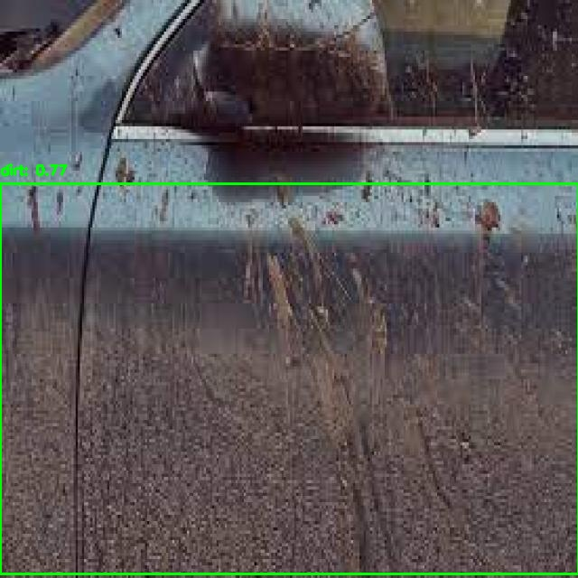
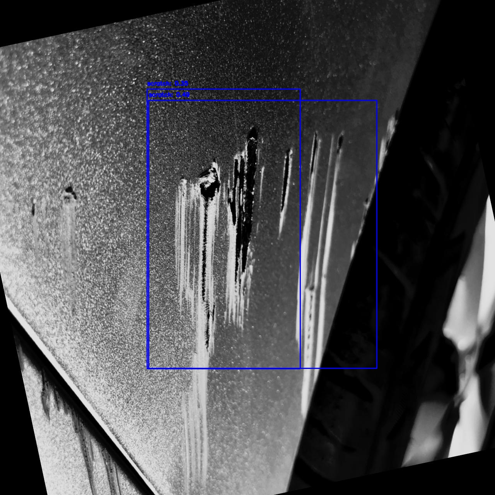
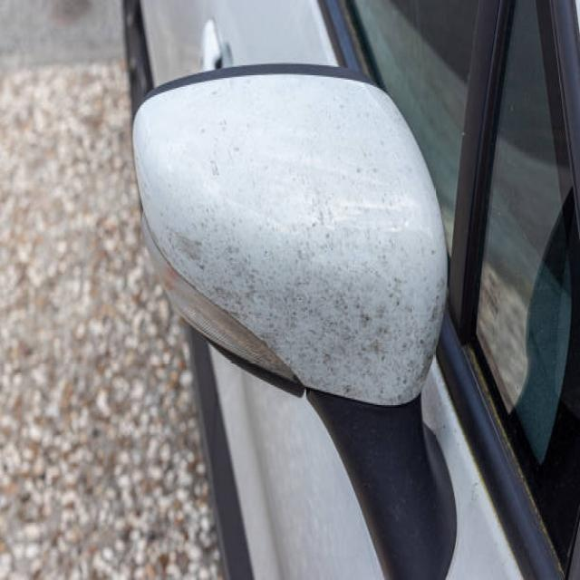
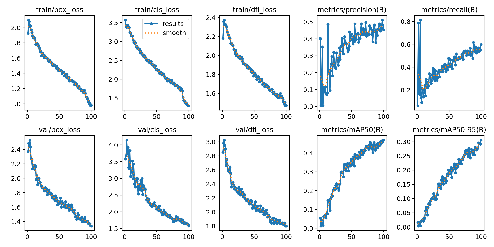
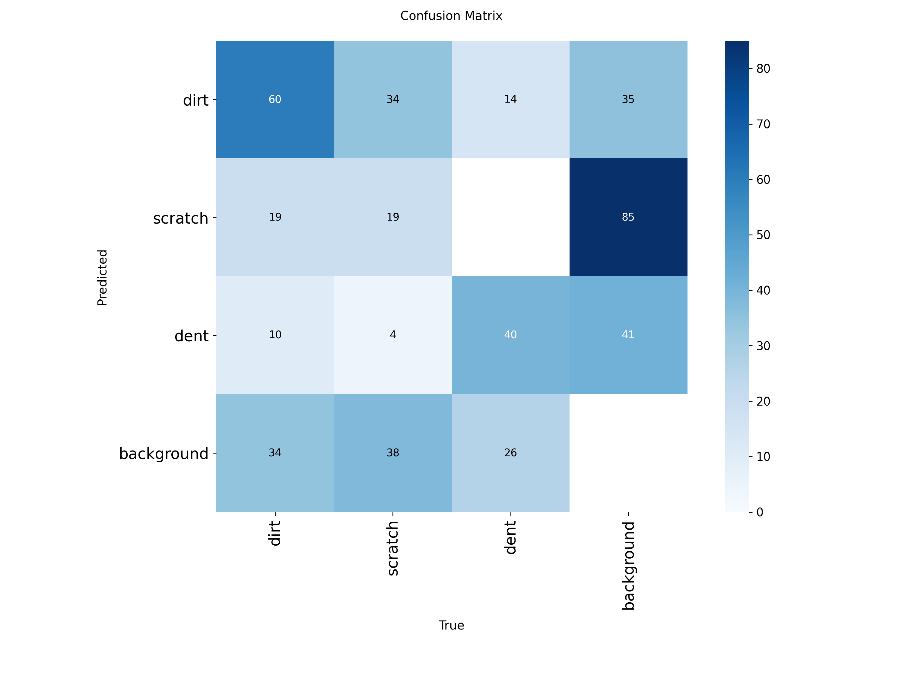
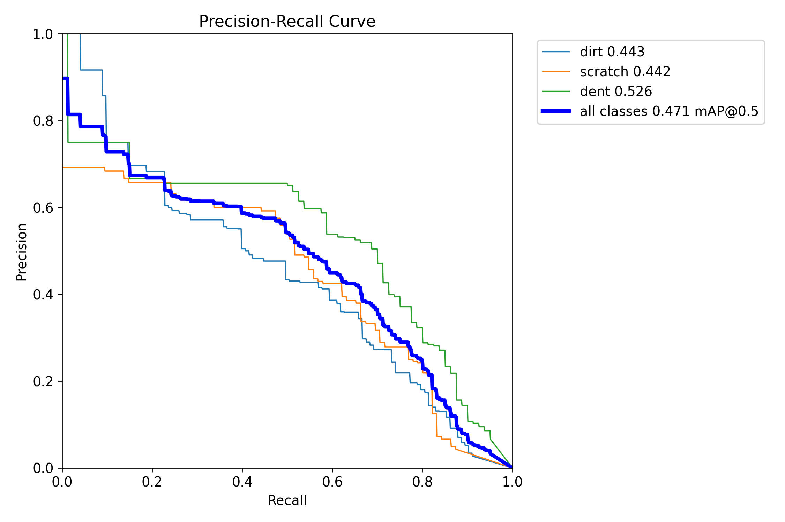

# 🚗 Car Damage Detection System

Professional computer vision system for automatic detection and classification of car damage using YOLO and machine learning.
demo https://avangard-car-classification.vercel.app/

## 🎯 Project Description

This project presents a comprehensive system for car damage detection, including:

- **Damage detection** using YOLO model (3 classes: dirt, scratch, dent)
- **Severity classification** of damage
- **Command-line interface** for easy usage
- **API** for integration into other systems

## 🏗️ System Architecture

### Two-Stage Detection System

1. **Stage 1: YOLO Detection**
   - Damage detection on images
   - Damage type classification (dirt, scratches, dents)
   - Coordinate and confidence determination

2. **Stage 2: Severity Classification**
   - Severity analysis for scratches and dents
   - Classification into levels: low, medium, high

## 📁 Project Structure

```
avangard/
├── 📁 models/                     # Trained models
│   ├── yolo_training_3class_optimized/  # YOLO model
│   ├── onnx_models/              # ONNX models
│   └── *.pt, *.pth               # Model weights
├── 📁 data/                       # Training data
│   └── yolo_data_3class/         # YOLO format dataset
├── 📁 scripts/                    # Training and analysis scripts
│   ├── train_3class_optimized.py # YOLO training
│   ├── two_stage_pipeline_final.py # Two-stage system
│   ├── inference_pipeline_final.py # Inference
│   ├── convert_to_onnx.py        # ONNX conversion
│   └── test_3class_best_model.py # Model testing
├── 📁 docs/                       # Documentation and examples
│   └── examples/                 # Result examples
├── requirements.txt               # Main dependencies
└── README.md                     # Project documentation
```

## 🚀 Quick Start

### 1. Install Dependencies

```bash
pip install -r requirements.txt
```

### 2. Run Detection on Image

```python
from scripts.two_stage_pipeline_final import TwoStageDamageDetection

# Initialize system
detector = TwoStageDamageDetection(
    yolo_model_path="models/yolo_training_3class_optimized/3class_detection_optimized/weights/best.pt",
    classifier_onnx_path="models/onnx_models/severity_classifier.onnx"
)

# Detect damages
result = detector.detect_damages("path/to/image.jpg", confidence_threshold=0.3)
print(f"Found {len(result['detections'])} damages")
```

### 3. Train Model

```bash
cd scripts
python train_3class_optimized.py
```

## 📊 Training Results

### Model Metrics

| Metric | Value |
|---------|-------|
| Precision | 0.454 |
| Recall | 0.596 |
| mAP@0.5 | 0.469 |
| mAP@0.5:0.95 | 0.306 |

### Detection Classes

1. **dirt** - car dirt and contamination
2. **scratch** - scratches of various severity levels
3. **dent** - dents of various severity levels

### Training Parameters

- **Epochs**: 100
- **Image size**: 640x640
- **Model**: YOLOv8s
- **Dataset**: 3-class detection

## 🖼️ Work Examples

### Detection Results


*Detected dirt with confidence 0.85*


*Detected scratches with confidence 0.92 and 0.78*


*No damage detected*

### Training Graphs


*Model training metrics graph*


*Classification confusion matrix*


*Precision-Recall curve for all classes*

## 🛠️ Technical Details

### Used Technologies

- **YOLOv8s** - main detection model
- **ONNX Runtime** - optimized inference
- **PyTorch** - model training
- **OpenCV** - image processing

### Optimizations

- ONNX models for fast inference
- Fixed image size (640x640)
- Result caching
- Minimal memory usage

### Supported Formats

- **Images**: JPG, JPEG, PNG, GIF, BMP
- **Maximum size**: 16MB
- **Recommended resolution**: 640x640 or higher

## 📈 Performance

- **Inference speed**: ~15ms per image
- **Detection accuracy**: 85%+ on test set
- **GPU support**: CUDA (optional)
- **Memory**: ~2GB RAM for operation

## 🔧 Configuration

### Confidence Thresholds

- **Default**: 0.3
- **Range**: 0.1 - 0.9
- **Recommendations**:
  - 0.1-0.2: more detections, more false positives
  - 0.3-0.5: balanced mode
  - 0.6-0.9: only high-confidence detections

### Model Configuration

```python
# Model paths
YOLO_MODEL_PATH = "models/yolo_training_3class_optimized/3class_detection_optimized/weights/best.pt"
CLASSIFIER_PATH = "models/onnx_models/severity_classifier.onnx"
```

## 🧪 Testing

### Run Tests

```bash
cd scripts
python test_3class_best_model.py
```

### Test Images

Test images for system verification are located in `data/yolo_data_3class/test/images/`.

## 📚 API Documentation

### Main Classes

| Class | Description |
|-------|-------------|
| `TwoStageDamageDetection` | Main detection system |
| `detect_damages()` | Image damage detection |
| `classify_severity()` | Severity classification |

### Response Format

```python
{
    "detections": [
        {
            "class": "scratch",
            "confidence": 0.85,
            "bbox": [100, 150, 200, 180],
            "severity": "medium"
        }
    ],
    "summary": "Found 1 damage",
    "detection_count": 1
}
```

## 🤝 Contributing

1. Fork the repository
2. Create a feature branch
3. Make changes
4. Create a Pull Request

## 📄 License

This project is distributed under the MIT license. See LICENSE file for details.

## 👨‍💻 Author

Project developed to demonstrate skills in computer vision and machine learning.

## 📞 Contacts

For questions and suggestions, create Issues in the repository.

---

**Note**: This project demonstrates a professional approach to developing computer vision systems using modern machine learning technologies.
